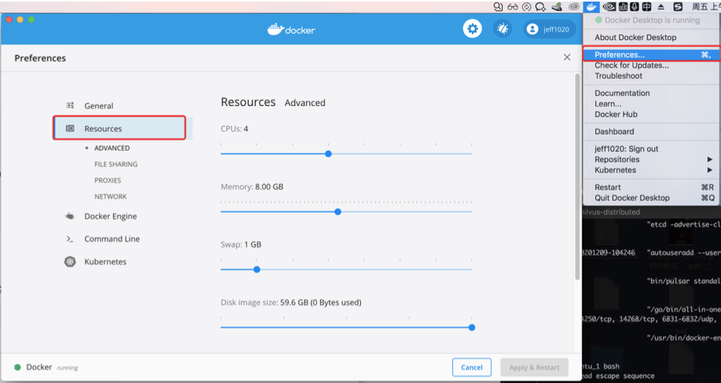
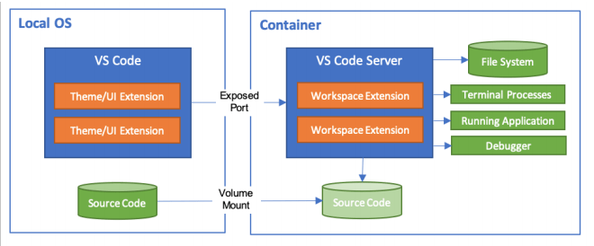
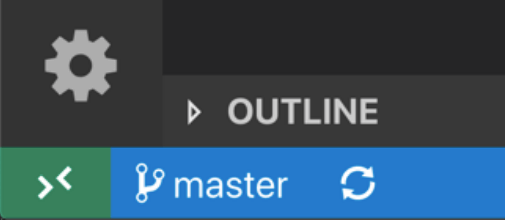
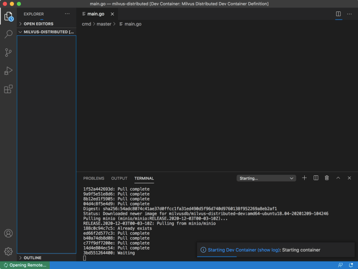
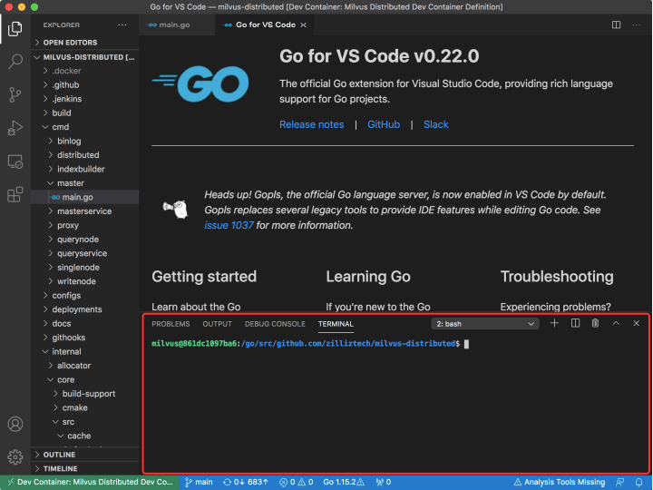

# Develop Milvus 2.0 on macOs

## Prerequisites

| Operating system | Requirements            |
| ---------------- | ----------------------- |
| CentOS           | Version 7.5 or higher   |
| Ubuntu LTS       | Version 16.04 or higher |
| macOS            | Version 10.14 or higher |

</br>

| Hardware | Recommended                                                                                                        |
| -------- | ------------------------------------------------------------------------------------------------------------------ |
| CPU      | x86_64 </br> >= Intel CPU Sandy Bridge </br> CPU Instruction set:</br> - SSE42</br> - AVX</br> - AVX2</br> -AVX512 |
| Memory   | At least 16 GB                                                                                                     |
| macOS    | >= SATA 3.0 SSD                                                                                                    |

## Before you begin

1. Run `$ docker info` to check if Docker Daemon is installed and is running.
2. Install [Docker CE/EE](https://docs.docker.com/get-docker/).

<div class="alert note">
To run Docker with <code>root</code>, create docker group and user first. Then run <code>sudo usermod -aG docker $USER</code>, and restart the terminal. 
</div>

3. Assign resources to the Docker. We recommend you to assign at least 4CPUs and 16GB of memory.



<div class="alert note">
If the compilation on macOs  or Docker is slow, you can accelerate the process by assigning more CPU and memory resources to the Docker.
</div>

4. Install [Docker Compose](https://docs.docker.com/compose/install/) and verify your Docker Compose version.

```
$ docker-compose version

docker-compose version 1.25.5, build 8a1c60f6
docker-py version: 4.1.0
CPython version: 3.7.5
OpenSSL version: OpenSSL 1.1.1f 31 Mar 2020
```

## Develop Milvus 2.0 on macOs

There are 2 ways to develop Milvus 2.0 on macOS. You can choose to either use Visual Studio Code (VS Code) with Docker or start Dev Container directly. However, using VS Code is the recommended way of development.

<div class="filter">
<a href="#vscode">Use VS Code with Docker</a> <a href="#devcontainer">Start Dev Container</a>
</div>

<div class="table-wrapper filter-vscode" markdown="block">

### Use VS Code with Docker

**Overview**

By using VS Code, you can mount the local file system to the workspace inside the container, or copy it to the container. The extension of VS Code is installed inside the container and runs in it, so that the VS Code of the host can fully access the tools, platforms and file systems inside the container. This means that you only need to connect to different containers to switch the entire development environment seamlessly.



Taking the Milvus project as an example, there is a file named **.devcontainer.json** in the root directory of the project. This file describes how VS Code accesses or creates a development container environment and defines the container environment, working directory, extension tool set, and more.

**Prerequisites**

- Install [Visual Studio Code](https://code.visualstudio.com/).
- Install [Remote Development extension pack](https://aka.ms/vscode-remote/download/extension).
- Integrate with VS Code.

**Configure the development environment**

1. Start VS Code in the command panel ( F1 ) and input **“Remote-Containers: Open Folder in Container”**. Select the project folder which contains the **devcontainer.json** file.

   Or you can click the button **"> <"** at the bottom right corner. Choose **“Remote-Containers: Open Folder in Container”**. Select the project folder which contains the **devcontainer.json** file.



2. VS Code loads and constructs Dev Container. Construction status is displayed in the progress bar.



3. When construction is finished, VS Code automatically connects to the container. And you can start coding in VS Code. You can also use the VS Code terminal to enter the Dev Container by choosing **"Terminal >> New Terminal"** in the navigation bar.



<div class="alert note">
Learn more about <a href="https://code.visualstudio.com/docs/remote/containers#_quick-start-open-an-existing-folder-in-a-container">Developing inside a Container</a>.

</div>

</div>

<div class="table-wrapper filter-devcontainer" markdown="block">

### Start Dev Container directly

1. Enter the root path of the Milvus project and run the following command:

```
$ ./scripts/devcontainer.sh up # start Dev container

Creating network "milvus-distributed_milvus" with the default driver
Creating milvus_jaeger_1 ... done
Creating milvus_minio_1 ... done
Creating milvus_pulsar_1 ... done
Creating milvus_etcd_1 ... done
Creating milvus_ubuntu_1 ... done
```

2. Check the running state of Dev Container:

```
$ docker ps
CONTAINER ID    IMAGE                                                                COMMAND                  CREATED          STATUS                             PORTS                                                                 NAMES
8835ee913953    quay.io/coreos/etcd:v3. 4.13                                         "etcd -advertise-cli…"   30 seconds ago   Up 29 seconds                      2379-2380 /tcp                                                        milvusdistributed_etcd_1
3bd7912f5e98    milvusdb/milvus-distributed-dev:amd64-ubuntu18.04- 20201209-104246   "autouseradd --user …"   30 seconds ago   Up 29 seconds                      22/tcp, 7777 /tcp                                                     milvusdistributed_ubuntu_1
9fa983091d3d    apachepulsar/pulsar: 2.6.1                                           "bin/pulsar standalo…"   30 seconds ago   Up 29 seconds                                                                                            milvus-distributed_pulsar_1
80687651517b    jaegertracing/all-in-one: latest                                     "/go/bin/all-in-one-…"   30 seconds ago   Up 29 seconds                      5775/udp, 5778/tcp, 14250/tcp, 14268/tcp, 6831-6832/udp, 16686/tcp    milvusdistributed_jaeger_1
22190b591d74    minio/minio:RELEASE.2020-12-03T00-03- 10Z                            "/usr/bin/docker-ent…"   30 seconds ago   Up 29 seconds (health: starting)   9000 /tcp milvusdistributed_minio_1
```

3. Enter Dev Container `milvus_ubuntu_1` where the compile environment is located:

```
$ docker exec -ti milvus_ubuntu_1 bash
```

4. Compile the project according to the **DEVELOPMENT.md**.

5. Stop Dev Container:

```
$ ./scripts/devcontainer.sh down # close Dev container

Stopping milvus_etcd_1 ... done
Stopping milvus_ubuntu_1 ... done
Stopping milvus_pulsar_1 ... done
Stopping milvus_jaeger_1 ... done
Stopping milvus_minio_1 ... done
Removing milvus_etcd_1 ... done
Removing milvus_ubuntu_1 ... done
Removing milvus_pulsar_1 ... done
Removing milvus_jaeger_1 ... done
Removing milvus_minio_1 ... done
Removing network milvus_milvus
```

</div>
